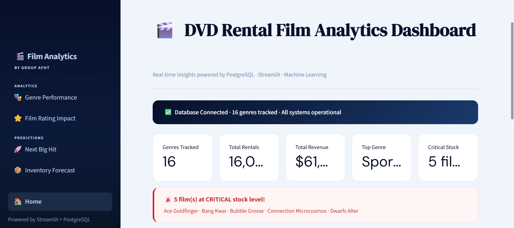

# 🎬 DVD Rental Film Analytics Dashboard

An interactive analytics dashboard built with **Streamlit** to monitor film performance, inventory health, and predictive insights using machine learning.

---

## 🚀 Overview

DVD Fix Analytics provides real-time insights into a film rental business using data visualization, database integration, and predictive modeling in a modern dashboard interface.

---

## ✨ Features

* 🎭 **Genre Performance Analysis**
* ⭐ **Film Rating Impact**
* 📦 **Inventory Forecast**
* 🚀 **Next Big Hit Prediction (ML)**
* 🔄 **Live Data Refresh**

---

## 🛠 Tech Stack

* **Frontend**: Streamlit
* **Backend**: Python
* **Database**: PostgreSQL
* **Data**: Pandas, NumPy
* **Visualization**: Plotly
* **ML**: Scikit-learn

---

## 📁 Project Structure

```bash
Visualization/
│
├── app.py
├── styles.py
├── db.py
├── requirements.txt
│
├── pages/
│   ├── 1_Genre_Performance.py
│   ├── 2_Film_Rating_Impact.py
│   ├── 3_Next_Big_Hit.py
│   └── 4_Inventory_Forecast.py
│
├── sql/
│   └── 01_setup_olap.sql
│
└── ml/
    └── train.py
```

---

## ⚙️ Setup Instructions

### 1. Clone repository

```bash
git clone https://github.com/niazayla/film-analytics-dashboard.git
cd film-analytics-dashboard
```

---

### 2. Create virtual environment

```bash
python -m venv venv
venv\Scripts\activate
```

---

### 3. Install dependencies

```bash
pip install -r requirements.txt
```

---

## 🗄️ Database Setup (IMPORTANT)

### 🔹 Step 1: Download sample database

Download PostgreSQL sample database (dvdrental):

👉 https://www.postgresqltutorial.com/wp-content/uploads/2019/05/dvdrental.zip

Extract it → you will get:

```
dvdrental.tar
```

---

### 🔹 Step 2: Create database

Open pgAdmin or terminal:

```sql
CREATE DATABASE your_database;
```

---

### 🔹 Step 3: Restore database

Using terminal:

```bash
pg_restore -U postgres -d your_database dvdrental.tar
```

Or via pgAdmin:

* Right click database → Restore
* Select `dvdrental.tar`

---

### 🔹 Step 4: Run OLAP / summary queries

This project uses additional summary tables.

Run:

```bash
psql -U postgres -d your_database -f sql/01_setup_olap.sql
```

---

### 🔹 Step 5: Configure `.env`

Create `.env` file:

```env
DB_HOST=localhost
DB_NAME=your_database
DB_USER=postgres
DB_PASS=yourpassword
```

---

## ▶️ Run the App

```bash
streamlit run app.py
```

---

## 🧠 Machine Learning

Train prediction model:

```bash
python ml/train.py
```

Model: **Random Forest**

* Predicts film success
* Estimates demand & revenue potential

---

## 📊 Data Source

* PostgreSQL Sample Database:
  https://www.postgresqltutorial.com/postgresql-sample-database/

* Dataset: **dvdrental.tar**

---

## ⚠️ Notes

* Do NOT upload `.env`
* Ensure PostgreSQL is running
* Run SQL setup before opening dashboard

---

## 📸 Preview



---

## 👤 Author

Your Name
https://github.com/niazayla

---

## 📄 License

MIT License
